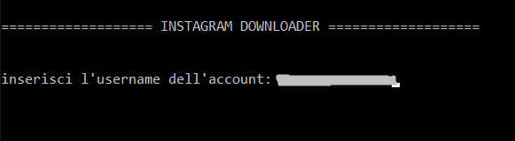

# Bulk-imgDownloader
Downloader di immagini che utilizza Python e BeautifulSoup.


## A cosa serve?
* Scarica tutte le immagini da un determinato URL e le salva nella directory dello script. 
* Vincoli: 
1. Un URL (da cui verranno scaricate le immagini) 
2. "Sì" o "No" (se l'utente desidera scaricare immagini dalle sottopagine dell'URL specificato)


## Uso

- Copiare il link da cui scaricare le immagini. 

- Usare il comando:
```python 
python image_downloader.py s 

# "s" scaricherà le immagini dalle sottopagine. 
# "n" significherà ottenere solo le immagini della root
``` 
**Se l'utente copia un collegamento non valido, l'esecuzione terminerà.**


## Output

Verrà generata automaticamente una cartella e le immagini verranno scaricate. 
Se sono presenti più di 50 immagini, il programma chiederà il permesso per continuare o interrompere l'operazione.

## Preview




